# 员工模块

## 新增员工

### 需求分析和设计

**前端提交的数据：**

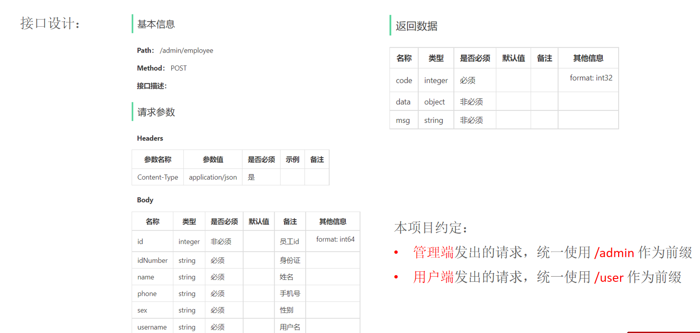


**使用DTO封装请求参数：**

```java
@Data
public class EmployeeDTO implements Serializable {
    private Long id;
    private String username; 
    private String name;
    private String phone;
    private String sex;
    private String idNumber;
}
```


---

### 开发

**Controller**

```java
@PostMapping
public Result save(@RequestBody EmployeeDTO emplyeeDTO) {
    employeeService.save(emplyeeDTO);
    return null;
}
```

**Service**

```java
public void save(EmployeeDTO emplyeeDTO) {
    Employee employee = new Employee();
    BeanUtils.copyProperties(emplyeeDTO, employee);

    employee.setStatus("1");
    employee.setPassword(DigestUtils.md5DigestAsHex("123456".getBytes()));

    employee.setCreateTime(LocalDateTime.now());
    employee.setUpdateTime(LocalDateTime.now());
    employee.setCreateUser("1L");
    employee.setUpdateUser("1L");
    
    employeeMapper.insert(employee);
}
```

**Mapper**

values上面是下划线， values下面是驼峰。这样也可以是因为配置文件中mybatis开启了自动驼峰命名。

```java
 
 @Insert("insert into employee (name, username, password, phone, sex, id_number, status, create_time, update_time, create_user, update_user) " +
   		 "values " +
            "(#{name},#{username},#{password},#{phone},#{sex},#{idNumber},#{status},#{createTime},#{updateTime},#{createUser},#{updateUser})")
    @AutoFill(value = OperationType.INSERT)
    void insert(Employee employee);
```


### 存在的问题


**1、录入的用户名已存在,抛出异常后没有处理**

当我们创建一个用户名存在的对象时，会报异常，并且返回500.

`java.sql.SQLIntegrityConstraintViolationException`

`Createbreakpoint: Duplicate entry'zhangsan'for key'employee.idx_username`

所以我们要捕获这个异常并且返回异常信息提示用户说zhangsan不存在。

**GlobalExceptionHandler**

```java
@RestControllerAdvice
public class GlobalExceptionHandler {
    @ExceptionHandler
    public Result exceptionHandler(SQLIntegrityConstraintViolationException ex) {
        //Duplicate entry 'zhangsan' for key 'employee.idx_username'
        String message = ex.getMessage();
        if(message.contains("Duplicate entry")) {
            String[] split = message.split(" ");
            String username = split[2];
            String msg = username + "已存在";
            return Result.error(msg);
        } else {
            return Result.error("未知错误");
        }
    }
}
```

这样就会返回200，并且友好地提示：''张三''已存在

  


**2、新增员工时,创建人id和修改人id设置为了固定值**

思路：通过某种方式动态获取当前登录员工的id

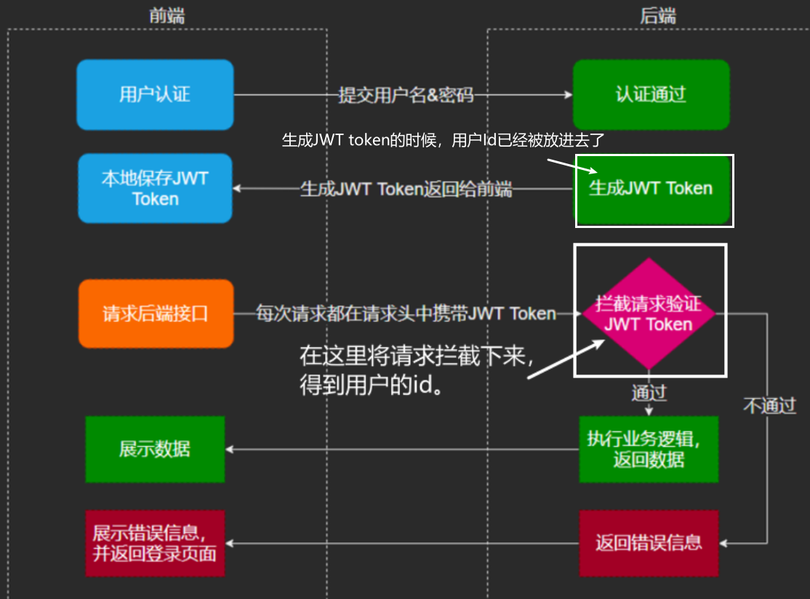


```java
public Result<EmployeeLoginVO> login(@RequestBody EmployeeLoginDTO employeeLoginDTO) {
    //在登录方法中，用户的id被put进token中
    claims.put(JwtClaimsConstant.EMP_ID, employee.getId());
}
```

```java
public boolean preHandle(...) throws Exception {
	//在拦截器中get出来，所以得到empid
    Long empId = Long.valueOf(claims.get(JwtClaimsConstant.EMP_ID).toString());
}
```


**取到id后，如何将id传给service？**

通过**ThreadLocal**传递

Thread是一个线程的局部变量，他为每个线程提供单独的一份存储空间，具有线程隔离的效果，只有在线程内才能获取到对应的值，线程外则不能访问。所以ThreadLocal起到一个类似于session的作用。

在Controller、Service和拦截器中，他们共享同一个ThreadLocal。

```java
ThreadLocal常用方法：
public void set(T value);	设置当前线程的线程局部变量的值
public T get(); 			返回当前线程所对应的线程局部变量的值
public void remove();       移除当前线程的线程局部变量
```


BaseContext提供了工具包封装ThreadLocal

```java
public class BaseContext {
    public static ThreadLocal<Long> threadLocal = new ThreadLocal<>();
    
    public static void setCurrentId(Long id) {
        threadLocal.set(id);
    }
    public static Long getCurrentId() {
        return threadLocal.get();
    }
    public static void removeCurrentId() {
        threadLocal.remove();
    }
}
```

step1：我们在拦截器中将empId放入ThreadLocal

```java
 public boolean preHandle(...) throws Exception {
	//在这里get出来，所以得到empid
    Long empId = Long.valueOf(claims.get(JwtClaimsConstant.EMP_ID).toString());
    BaseContext.setCurrentId(empId);
} 
```

step2:在Service中取出empId

```java
public void save(EmployeeDTO emplyeeDTO) {
    employee.setCreateUser(BaseContext.getCurrentId());
    employee.setUpdateUser(BaseContext.getCurrentId());
}
```

 

这样就解决了问题2


## 分页查询

### 需求分析和设计

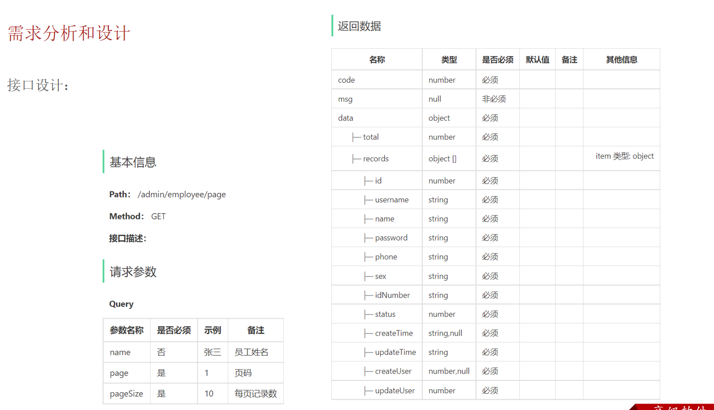

*	注意请求参数的格式是Query
*	返回数据中data较复杂，records的类型是Object数组，存放了很多个用员工封装的数据。


**使用DTO封装请求参数:**

```java
@Data 
public class EmployeePageQueryDTO implements Serializable {
    //员工姓名
    private String name;  
    //页码   
    private int page; 
    //每页显示记录数    
    private int pageSize;
}

```


返回的数据类型统一封装成result。对于分页查询，用以封装成PageResult对象。

```java
public class PageResult  {
    private long total; //总记录数
    private List records; //当前页数据集合
}
```

这个PageResult对应的是Result的data中的数据。

所以最终要返回给前端的对象是`Result<PageResult>`


---

### 开发

**Controller**

```java
@GetMapping("/page")
//在Spring MVC中，当请求参数的名字与你的实体类的属性名字匹配时，Spring MVC 会自动进行参数的绑定。
//前端请求中的name、page、pageSize参数会被自动映射到EmployeePageQueryDTO对象的相应属性中。
//返回数据类型是query不是Json，所以不用加@ResponseBody
public Result<PageResult> page(EmployeePageQueryDTO employeePageQueryDTO) {    
    PageResult pageResult = employeeService.pageQuery(employeePageQueryDTO);
    return Result.success(pageResult);
}
```

**Service**

```java
 public PageResult pageQuery(EmployeePageQueryDTO employeePageQueryDTO) {
    //分页查询
    PageHelper.startPage(employeePageQueryDTO.getPage(),
                         employeePageQueryDTO.getPageSize());
    Page<Employee> page = employeeMapper.pageQuery(employeePageQueryDTO);
    long total = page.getTotal();
    List<Employee> records = page.getResult();

    return new PageResult(total, records);
}
```


```JAVA
疑问：pageQuery和startPage方法到底有什么关系？  
    startPage并没有给pageQuery传入什么参数，那他怎么知道这些page和pageSize？
	源码：

    Page<E> page = new Page(pageNum, pageSize, count);
    page.setReasonable(reasonable);
    page.setPageSizeZero(pageSizeZero);
    Page<E> oldPage = getLocalPage();
    if (oldPage != null && oldPage.isOrderByOnly()) {
        page.setOrderBy(oldPage.getOrderBy());
    }
	//关键的代码
    setLocalPage(page);  
   最后会把page存入ThreadLocal，然后在拼接SQL语句的时候，将page从ThreadLocal取出来，动态拼接到SQL语句的最后的 limit ?,?
	
```

**Mapper**

```xml

Page<Employee> pageQuery(EmployeePageQueryDTO employeePageQueryDTO);

<select id="pageQuery" resultType="com.sky.entity.Employee">
    select * from employee
    <where>
        <if test="name != null and name != ''">
            #下面这个and可以去掉，如果不去掉，if条件成立的话，最后生成的SQL语句会自动把这个and去掉
            and name like concat('%',#{name},'%')
        </if>
    </where>
    order by create_time desc
</select>
```


### 功能完善

最后显示的时间，格式存在问题。

解决方案：

**1.在属性上加入注解，对日期进行格式化**

```java
@JsonFormat(pattern="yyyy-MM-dd HH:mm:ss")
private LocalDateTime updateTime
```

但是这种处理方式只能处理单个的。


**2.在WebMvcConfiguration中扩展SpringMVC的消息转换器,统一日期类型进行格式化处理**

```java
protected void extendMessageConverters(List<HttpMessageConverter<?>> converters) {

    MappingJackson2HttpMessageConverter messageConverter = new MappingJackson2HttpMessageConverter();

    //为消息转换器设置对象转换器,将java对象序列化为json数据
    messageConverter.setObjectMapper(new JacksonObjectMapper());
    //设置好之后还没结束，因为消息转化器还没交给框架
    //将自己的消息转换器加入容器（交给框架）
    converters.add(0,messageConverter); //第一个参数是优先级
}
```


```java
/**
 * 对象映射器:基于jackson将Java对象转为json，或者将json转为Java对象
 * 将JSON解析为Java对象的过程称为 [从JSON反序列化Java对象]
 * 从Java对象生成JSON的过程称为 [序列化Java对象到JSON]
 */
public class JacksonObjectMapper extends ObjectMapper {

    public static final String 格式1 = "yyyy-MM-dd";
    public static final String 格式2 = "yyyy-MM-dd HH:mm:ss";
    public static final String 格式3 = "HH:mm:ss";

    public JacksonObjectMapper() {
        //下面这些给LocalDate设置了一些列的序列化和反序列化
        //前三个是Deserializer，后三个是Serializer
        SimpleModule simpleModule = new SimpleModule()
        	 .addDeserializer(LocalDateTime.class, new LocalDateTimeDeserializer(格式2))
             .addDeserializer(LocalDate.class, new LocalDateDeserializer(格式1))
             .addDeserializer(LocalTime.class, new LocalTimeDeserializer(格式3))
            
             .addSerializer(LocalDateTime.class, new LocalDateTimeSerializer(格式2))
             .addSerializer(LocalDate.class, new LocalDateSerializer(格式1))
             .addSerializer(LocalTime.class, new LocalTimeSerializer(格式3);

        //注册功能模块 例如，可以添加自定义序列化器和反序列化器
        this.registerModule(simpleModule);
    }
}
```

功能完善完成！


## 启用、停用员工账号

### 需求分析和设计

**业务规则:**

* 可以对状态为"启用"的员工账号进行"禁用"操作
* 可以对状态为"禁用"的员工账号进行"启用"操作
* 状态为"禁用"的员工账号不能登录系统


**接口设计**

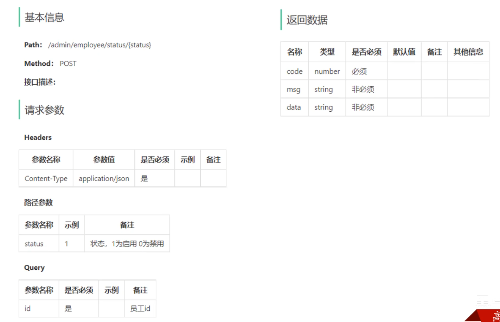


### 开发

**Controller**

```java
@PostMapping("status/{status}")
public Result startOrStop(@PathVariable Integer status, Long id) {
    employeeService.startOrStop(status, id);
    return Result.success();
}
```

**Service**

```java
public void startOrStop(Integer status, Long id) {
    // update employee set status = ? where id = ?
    Employee employee = Employee.builder()
        .status(status)
        .id(id)
        .build();
    employeeMapper.update(employee);
}
```

**Mapper**

```xml
void update(Employee employee);

<update id="update" parameterType="Employee">
    update employee
    <set>
        <if test="name != null">name = #{name}, </if>
        <if test="username != null">username = #{username}, </if>
        <if test="password != null">password = #{password}, </if>
        <if test="phone != null">phone = #{phone}, </if>
        <if test="sex != null">sex = #{sex}, </if>
        <if test="idNumber != null">id_number = #{idNumber}, </if>
        <if test="updateTime != null">update_time = #{updateTime}, </if>
        <if test="updateUser != null">update_user = #{updateUser}, </if>
        <if test="status != null">status = #{status} </if>
    </set>
    where id = #{id}
</update>
```


## 编辑员工

### 需求分析和设计

回显员工新的的接口设计：

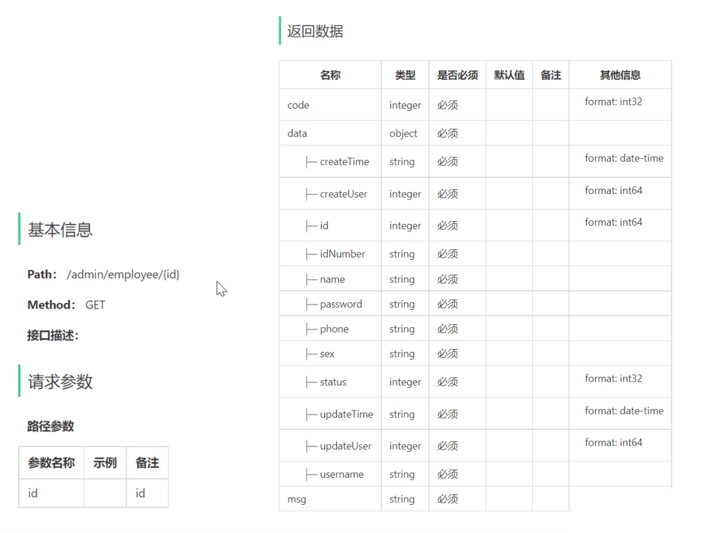

更新员工新的接口信息：

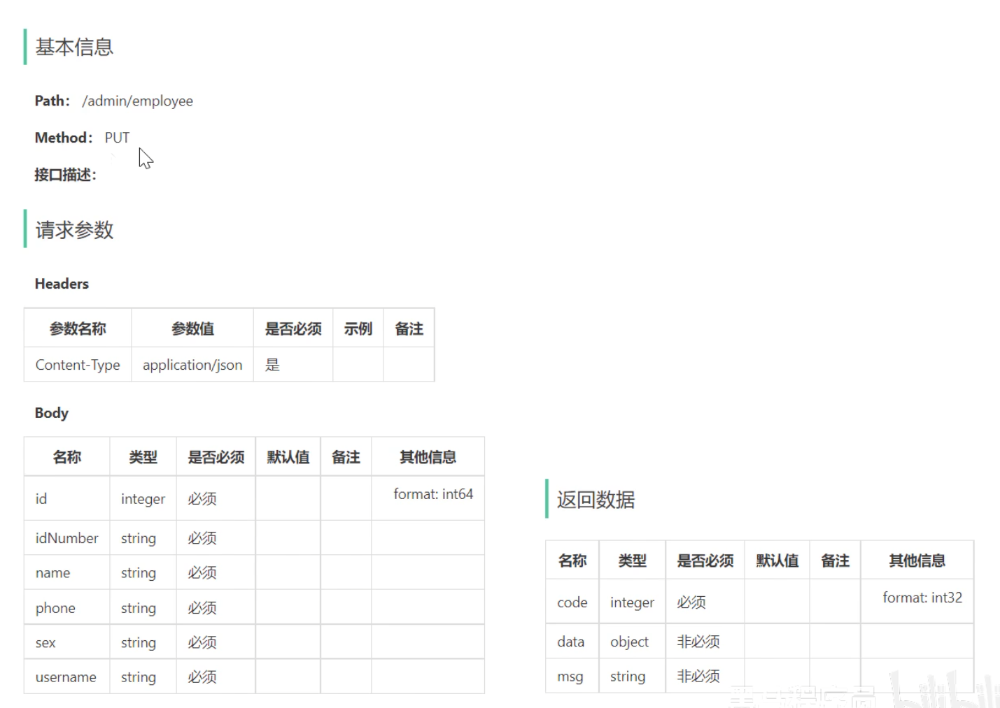

---


### 开发

**Controller**

首先要把原来的信息回显到编辑框中，然后再进行修改

```java
@GetMapping("/{id}")
@ApiOperation(value = "回显员工信息")
public Result<Employee> getById(@PathVariable Long id) {
    Employee employee = employeeService.getById(id);
    return Result.success(employee);
}

@PutMapping
@ApiOperation(value = "编辑员工信息")
public Result update(@RequestBody EmployeeDTO employeeDTO) {
    employeeService.update(employeeDTO);
    return Result.success();
}

```


**Service**

```java
@Override
public Employee getById(Long id) {
    Employee employee = employeeMapper.getById(id);
    employee.setPassword("****"); //设置默认密码
    return employee;
}

@Override
public void update(EmployeeDTO employeeDTO) {
    Employee employee = new Employee();
    BeanUtils.copyProperties(employeeDTO,employee); //将DTO中的属性拷贝给employee
    employeeMapper.update(employee);
}
```


**Mapper**

```xml
#回显数据
@Select(" select * from employee where id = #{id}")
Employee getById(Long id);

#更新数据
void update(Employee employee);
<update id="update" parameterType="Employee">
    update employee
    <set>
        <if test="name != null">name = #{name}, </if>
        <if test="username != null">username = #{username}, </if>
        <if test="password != null">password = #{password}, </if>
        <if test="phone != null">phone = #{phone}, </if>
        <if test="sex != null">sex = #{sex}, </if>
        <if test="idNumber != null">id_number = #{idNumber}, </if>
        <if test="updateTime != null">update_time = #{updateTime}, </if>
        <if test="updateUser != null">update_user = #{updateUser}, </if>
        <if test="status != null">status = #{status} </if>
    </set>
    where id = #{id}
</update>
```

 


# 公共字段自动填充

问题：代码冗余，不利于后期维护

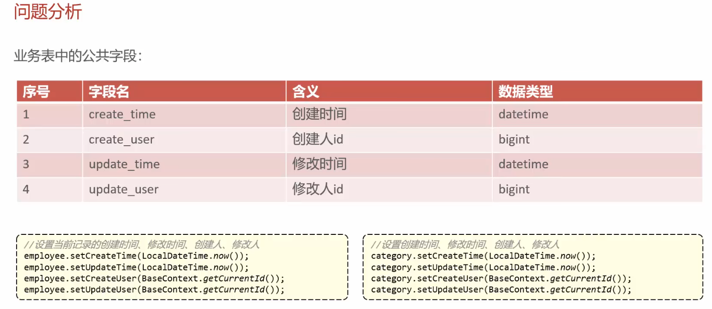

解决方案：

* 自定义注解AutoFill，用于标识需要进行公共字段自动填充的方法
* 自定义切面类AutoFillAspect，统一拦截加入了AutoFill注解的方法，通过反射为公共字段赋值
* 在Mapper上加入注解


```java
---数据库操作类型类
public enum OperationType {
    //更新
    UPDATE, 
    //插入操作
    INSERT
}

---注解类
@Target(ElementType.METHOD)
@Retention(RetentionPolicy.RUNTIME)
public @interface AutoFill {
    OperationType value();
}

---切面类
@Aspect
@Component
@Slf4j
public class AutoFillAspect {
    //切入点
    @Pointcut("execution (* com.sky.mapper.*.*(..)) && @annotation(com.sky.annotation.AutoFill)")
    public void autoFillPointCut(){}
    
    //前置通知，在通知中进行公共字段的复制
    @Before("autoFillPointCut()")
    public void autoFill(JoinPoint joinPoint) {
        //获取到当前被拦截方法上的操作类型
        MethodSignature signature = (MethodSignature) joinPoint.getSignature(); //方法签名对象
        AutoFill autoFill = signature.getMethod().getAnnotation(AutoFill.class); //获得方法上的注解对象
        OperationType operationType = autoFill.value(); //获得数据库操作类型
        
        //获取到当前被拦截的方法的参数 -- 实体对象
        Object[] args = joinPoint.getArgs();
        if(args == null ||arhs.lenth == 0) return;
        
        Object entity = args[0];
        //准备赋值的数据
        LocalDateTime now = LocalDateTime.now();
        Long currentId = BaseContext.getCurrentId();
        
        //根据不同操作类型为对应的属性通过反射赋值
        if(operationType == OperationType.INSERT) {
            Method setXXX = entity.getClass().getDeclaredMethod("serXXX", 类型);
            //通过反射为对象属性赋值
            setXXX.invoke(entity, now);
        } else {
            Method setXXX = entity.getClass().getDeclaredMethod("serXXX", 类型);
            setXXX.invoke(entity, now);
        }
        
    }
    
}


```


# 菜品模块

## 新增菜品

```java
---controller

@PostMapping
public Result save(@RequestBody DishDTO dishDTO) {
    dishService.saveWithFlavor(dishDTO);
    return Result.success();
}

---service
    
//保存菜品的同时也会修改口味表，所以要加注解
@Transactional
public void saveWithFlavor(DishDTO dishDTO) {
    ---新增菜品表
    //dishDTO中包含了flavor数据，所以新增菜品表的时候，不能用dishDTO
	Dish dish = new Dish();
    BeanUtils.copyProperties(dishDTO, dish);
    
    @AutoFill(value = OperationType.INSERT) //这个是在mapper写的，公共字段自动填充
    dishMapper.insert(dish);
  
    ---新增口味表
	//获取到insert语句生成的主键值
    Long dishId = dish.getId();
	List<DishFlavor> flavors = dishDTO.getFlavors();
    if(flavors != null && flavors.size() > 0) {
        //在插入之前，为口味赋值对应菜品的id
        flavors.foreach(dishFlavor -> {
            dishFlavor.serDishId(dishId);
        })
        dishFlavorMapper.insertBatch(flavors);
    }
}
```


xml:

---插入菜品

在前端，插入菜品是不需要输入菜品的主键id的。这个id是在插入菜品时，自动生成的。所以

这里使用了

useGeneratedKeys="true"：表示要使用到插入数据后自动生成的主键id

keyProperty = "id" ：表示这个自动生成的主键id赋值给了dish.id属性

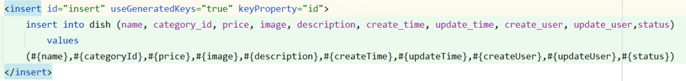

---插入口味

这里口味的dish_id就是上面插入菜品后生成了id然后set上去的。

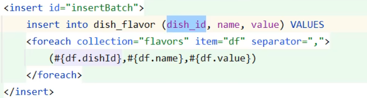


## 删除菜品

**业务规则：**

* 一次可以删除一个或多个菜品。
* 起售菜品不能删除
* 被套餐关联的菜品不能删除
* 删除菜品后，关联的口味数据也要删除


### 接口设计

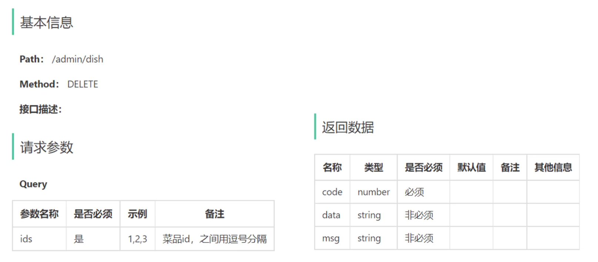

这里ids接受的方法为：使用List集合来接受，mvc框架自动去分割

controller:

```java
@DeleteMapping
public Result delete(@RequestParam List<Long> ids) {
    dishService.deleteBatch(ids);
    return Result.success();
}
```


---

删除操作涉及到三张数据库

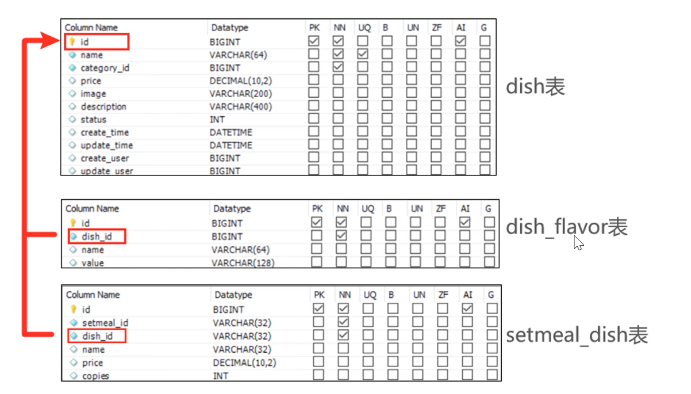

service

```java
public void deleteBatch (List<Long> ids) {
    //起售中的菜品无法删除
    for(Long id : ids) {
        Dish dish = dishMapper.getById(id);
        if(dish.getStatus() == StatusConstant.ENABLE) {
            throw new DeletionNotAllowedException("起售中的菜品无法删除");
        }
    }

    //被套餐关联的菜品可以删除
    List<long> setmealIds = setmealDishMapper.getSetmealIdsByDishIds(ids);
    if(setmealIds != null && setmealIds.size() > 0) {
        throw new DeletionNotAllowedException("套餐关联菜品无法删除");
    }

    //走到这里就可以删除了
    for(Long id : ids) {
        //删除菜品
        @Delete("delete from dish where id = #{id}")
        dishMapper.deleteById(id);
        //删除菜品关联的口味数据
        @Delete("delete from dish_flavor where dish_id = #{dishId}")
        dishFlavorMapper.deleteByDishId(id);
    }
}
```


xml:

```xml
<select id="getSetmealIdsByDishIds" resultType="java.lang.Long">>
	select setmeal_id from setmeal_dish where dish_id in 
    <foreach collection="dishIds" item="dishId" separator="," open"(" close=")">
    	#{dishId}
    </foreach>
</select>
```


## 修改菜品

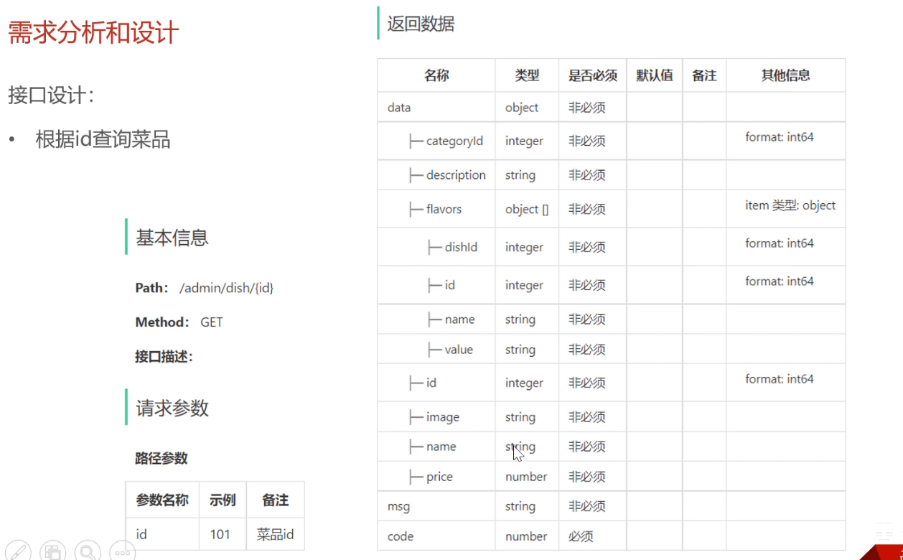

这里查询要有口味和菜品

```java
@GetMapping("{id}")
@ApiOperation("根据id查询菜品")
public Result<DishVO> getById(@PathVarible Long id) {
    DishVO dishVO = dishService.getByIdWithFlavor(id);
    return Result.success(dishVO);
}

---service
    
public DishVO getByIdWithFlavor(Long id) {
    Dish dish = dishMapper.getByid(id);
    List<DishFlavor> dishFlavors = dishFlavorMapper.getByDishId(id);
    
    DishVO dishVO = new DishVO();
    BeanUtils.copyProperties(dish, dishVO);
    //把口味set进去
    dishVO.setFlavors(dishFlavors);
    return dishVO;
}
```

修改菜品

```java
@PutMapping
public Result update(@RequestBody DishDTO dishDTO) {
    dishService.updateWithFlavor(dishDTO);
    return Result.success();
}

---service
public void updateWithFlavor(DishDTO dishDTO) {
    Dish dish = new Dish();
    BeanUtils.copyProperties(dishDTO, dish);
    
    dishMapper.update(dish);
    
    //删除原有的口味数据
    dishFlavorMapper.deleteByDishId(dishDTO.getId());
    
    List<DishFlavor> flavors = dishDTO.getFlavors;
    //插入口味数据
    if(flavors != null && flavors.size() > 0) {
        flavors.forEach(dishFlavor -> {
            dishFlavor.setDishId(dishDTO.getId());
        });
        dishFlavorMapper.insertBatch(flavors);
    }
}
    
```

更新的动态sql：

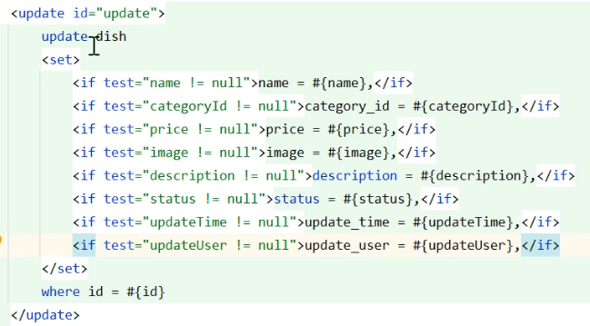


# 套餐模块

## 新增套餐

新增套餐需要先加载菜品，然后选择菜品进对应的套餐

接口设计：

### 1、根据分类id查询菜品

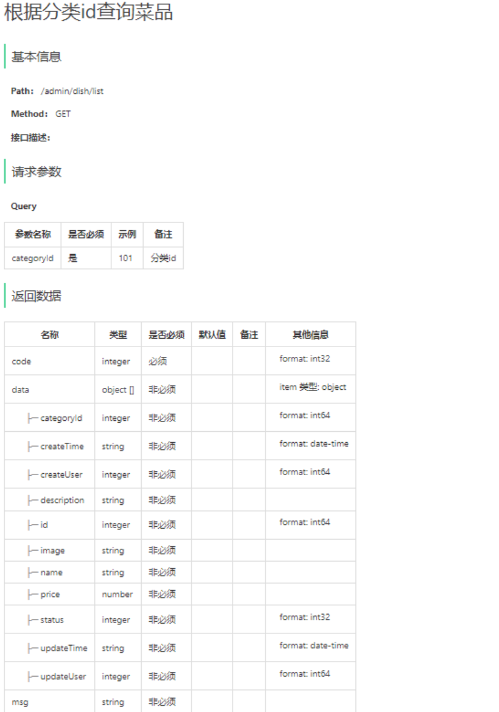

```java
---controller

@GetMapping("/list")
public Result<List<Dish>> list(Long categoryId) {
    List<Dish> list = dishService.list(categoryId);
    return Result.success(list);
}

---service
    
public List<Dish> list(Long categoryId) {
    Dish dish = Dish.builder()
        .categoryId(categoryId)
        .status(StatusConstant.ENABLE)
        .build();
    return dishMapper.list(dish);
}
```

mapper:

```xml
<select id="list" resultType="Dish" parameterType="Dish">
    select * from dish
    <where>
        <if test="name != null">
            and name like concat('%',#{name},'%')
        </if>
        <if test="categoryId != null">
            and category_id = #{categoryId}
        </if>
        <if test="status != null">
            and status = #{status}
        </if>
    </where>
    order by create_time desc
</select>
```


### 2、新增套餐

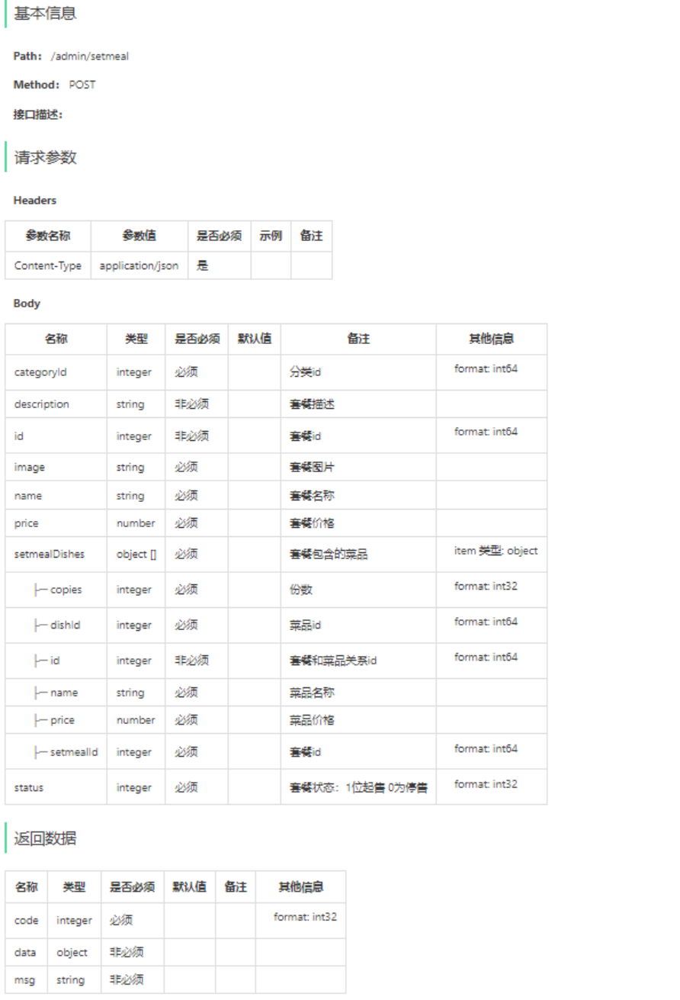

```java
//---controller
    
@PostMapping
public Result save(@RequestBody SetmealDTO setmealDTO) {
    setmealService.saveWithDish(setmealDTO);
    return Result.success();
}

//---service
    
@Transactional
public void saveWithDish(SetmealDTO setmealDTO) {
    //新增套餐表
    Setmeal setmeal = new Setmeal();
    BeanUtils.copyProperties(setmealDTO, setmeal);
    
    @AutoFill(value = OperationType.INSERT)
    setmealMapper.insert(setmeal);
    
    //新增菜品表
    Long sermealId = setmeal.getId();
    
    List<SetmealDish> setmealDishes = setmealDTO.getSetmealDishes();
    setmealDishes.forEach(setmealDish -> {
        setmealDish.setSetmealId(setmealId);
    });
    
    setmealDishMapper.insertBatch(setmealDishes);
}
```

Mapper

```xml
---setmealMapper

<insert id="insert" parameterType="Setmeal" useGeneratedKeys="true" keyProperty="id">
    insert into setmeal
    (category_id, name, price, status, description, image, create_time, update_time, create_user, update_user)
    values (#{categoryId}, #{name}, #{price}, #{status}, #{description}, #{image}, #{createTime}, #{updateTime},
    #{createUser}, #{updateUser})
</insert>

---setmealDishMapper
<insert id="insertBatch" parameterType="list">
    insert into setmeal_dish
    (setmeal_id,dish_id,name,price,copies)
    values
    <foreach collection="setmealDishes" item="sd" separator=",">
        (#{sd.setmealId},#{sd.dishId},#{sd.name},#{sd.price},#{sd.copies})
    </foreach>
</insert>
```


## 套餐分页查询

接口设计

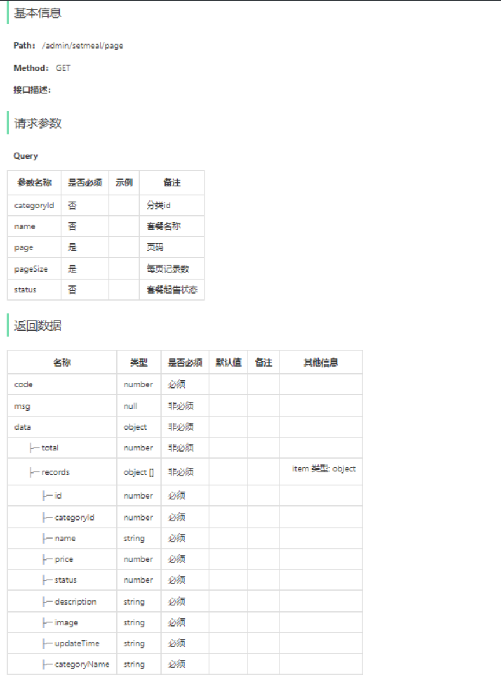


```java
//---controller
@GetMapping("/page")
public Result<PageResult> page(SetmealPageQueryDTO setmealPageQuertDTO) {
    PageResult pageResult = setmealService.pageQuery(setmealPageQueryDTO);
    return Result.success(pageResult);
}

//---service
public PageResult pageQuery(SetmealPageQueryDTO setmealPageQueryDTO) {
    int pageNum = setmealPageQueryDTO.getPage();
    int pageSize = setmealPageQueryDTO.getPageSize();
    
    PageHelper.startPage(pageNum, pageSize);
    Page<SetmealVO> page = setmealMapper.pageQuery(setmealPageQueryDTO);
    return new PageResult(page.getTotal(), page.getResult);
}

//mapper
<select id="pageQuery" resultType="com.sky.vo.SetmealVO">
    select
    	s.*,c.name categoryName
    from
    	setmeal s
    left join
    	category c
    on
    	s.category_id = c.id
    <where>
        <if test="name != null">
            and s.name like concat('%',#{name},'%')
        </if>
        <if test="status != null">
            and s.status = #{status}
        </if>
        <if test="categoryId != null">
            and s.category_id = #{categoryId}
        </if>
    </where>
    order by s.create_time desc
</select>
```


## 删除套餐

接口设计

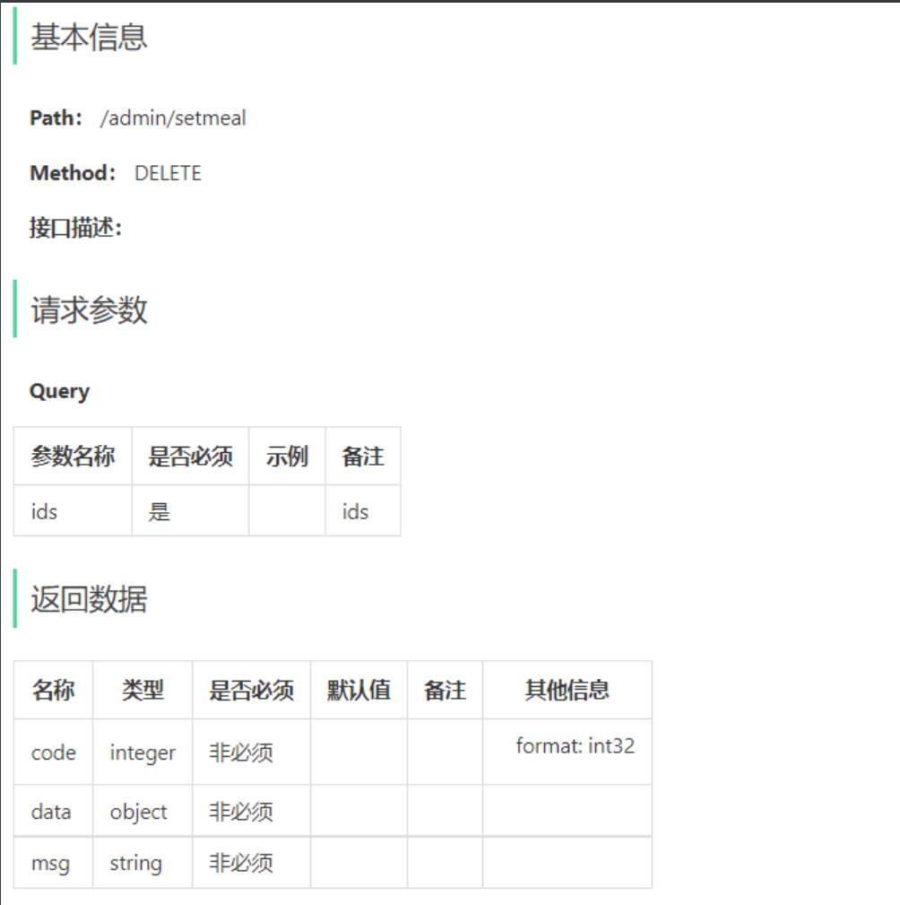


```java
//---controller
@DeleteMapping
public Result delete(@RequestParam List<Long> ids) {
    setmealService.deleteBatch(ids);
    return Result.success();
}

//---service
@Transactional
public void deleteBatch(List<Long> ids) {
    ids.forEach(id -> {
        Setmeal setmeal = setmealMapper.getById(id);
        if(StatusConstant.ENABLE == setmeal.getStatus()) {
            throw new DeletionNotAllowedExcepion("起售中的套餐不能删除");
        }
    });
    
    ids.forEach(setmealId -> {
        //删除套餐表中的数据
        setmealMapper.deleteById(setmealId);
        //删除套餐菜品关系表中的数据
        setmealDishMapper.deleteBySetmealId(setmealId);
    });
}

//---Mapper
@Select("select * from setmeal where id = #{id}")
Setmeal getById(Long id);

@Delete("delete from setmeal where id = #{id}")
void deleteById(Long setmealId);

@Delete("delete from setmeal_dish where setmeal_id = #{setmealId}")
void deleteBySetmealId(Long setmealId);
```


## 修改套餐

接口设计：一共有5个接口

- 根据id查询套餐
- 根据类型查询分类（已完成）
- 根据分类id查询菜品（已完成）
- 图片上传（已完成）
- 修改套餐

### 1、根据id查询套餐

```java
//controller
@GetMapping("/{id}")
public Result<SetmealVO> getById(@PathVariable Long id) {
    SetmealVO setmealVO = setmealService.getByIdWithDish(id);
}

//service
public SetmealVO getByIdWithDish(Long id) {
    Setmeal setmeal = setmealMapper.getById(id);
    List<SetmealDish> setmealDishes = setmealDishMapper.getBySetmealId(id);
    
    SetmealVO setmealVO = new SetmealVO();
    BeanUtils.copyProperties(setmeal, setmealVO);
    setmealVO.setSetmealDishes(setmealDishes);
    
    return setmealVO;
}

//mapper
@Select("select * from setmeal_dish where setmeal_id = #{setmealId}")
List<SetmealDish> getBySetmealId(Long setmealId);


```


### 2、修改套餐

```java
//controller
@PutMapping
public Result update(@RequestBody SetmealDTO setmealDTO) {
    setmealService.update(setmealDTO);
    return Result.success();
}

//service
@Transactional
public void update(SetmealDTO setmealDTO) {
    Setmeal setmeal = new Setmeal();
    BeanUtils.copyPeoperties(setmealDTO, setmeal);
    
    setmealMapper.update(setmeal);
    
    Long setmealId = setmealDTO.getId();
    
    //删除原来的菜品-套餐关系
    setmealDishMapper.deleteBySetmealId(setmealId);
    //得到新的菜品-套餐关系
    List<SetmealDish> setmealDishes = setmealDTO.getSetmealDishes();
    
    setmealDishes.forEach(setmealDish -> {
        //设置主键
        setmealDish.setSetmealId(setmealId);
    });
    
    setmealDishMapper.insertBatch(setmealDishes);
 }

//mapper
<insert id="insertBatch" parameterType="list">
    insert into setmeal_dish
    (setmeal_id,dish_id,name,price,copies)
    values
    <foreach collection="setmealDishes" item="sd" separator=",">
        (#{sd.setmealId},#{sd.dishId},#{sd.name},#{sd.price},#{sd.copies})
    </foreach>
</insert>
```


## 起售停售套餐

```java
//controller

@PostMapping("/status/{status}")
public Result startOrStop(@PathVariable Integer status, Long id) {
    setmealService.startOrStop(status, id);
    return Result.success();
}

//service
public void startOrStop(Integer status, Long id) {
    //停售不用额外判断，起售则 需要看套餐内有没有停售的菜品
    if(status == StatusConstant.ENABLE) {
        @select("select a.* from dish a left join setmeal_dish b on a.id = b.dish_id where b.setmeal_id = ?")
        List<Dish> dishList = dishMapper.getBySetmealId(id);
        
        if(dishList != null && dishList.size() > 0) {
            dishList.forEach(dish -> {
                //套餐内有停售的菜品，则起售失败
                if(StatusConstant.DISABLE == dish.getStatus()) {
                    throw new Exception("起售失败")
                }
            })
        }
    }
    
    Setmeal setmeal = Setmeal.builder()
        .id(id)
        .status(status)
        .build();
    setmealMapper.update(setmeal);
}

//mapper
@Select("select a.* from dish a left join setmeal_dish b on a.id = b.dish_id where b.setmeal_id = #{setmealId}")
List<Dish> getBySetmealId(Long setmealId);
```


# 设置店铺营业状态

接口设计

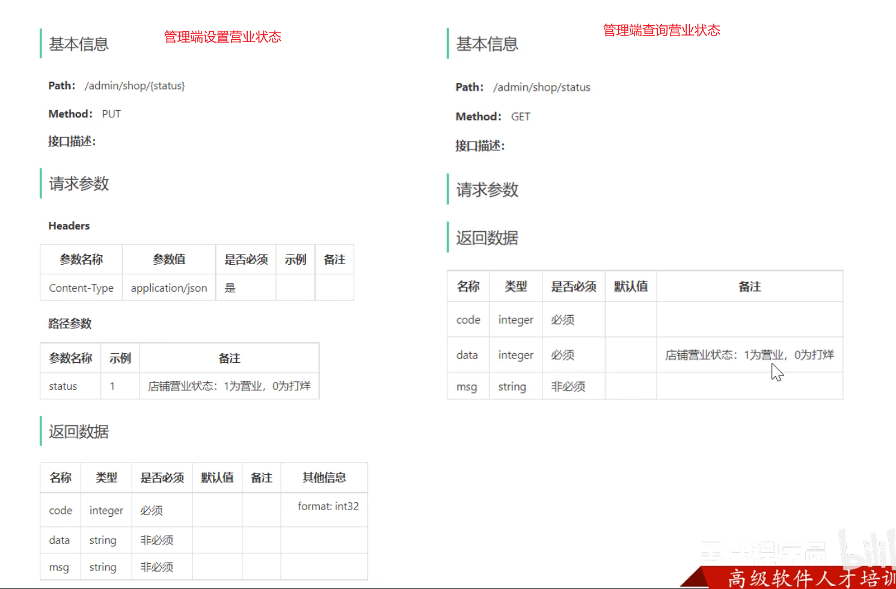

 

```java
---设置店铺营业状态
    
@PutMapping("/{status}")
public Result setStatus(@PathVariable Integer status) {
    redisTemplate.opsForValue().set("SHOP_STATUS", status);
    return Result.success();
}

@GetMapping("/status")
public Result<Integer> getStatus() {
    Integer status = (Integer) redisTemplate.opsForValue().get("SHOP_STATUS");
    return Result.success(status);
}

```

